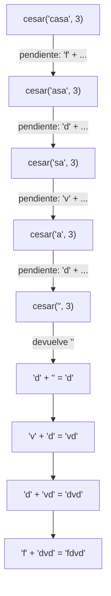
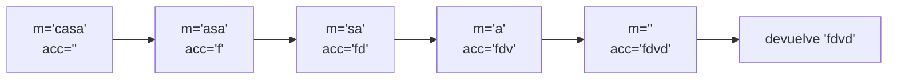
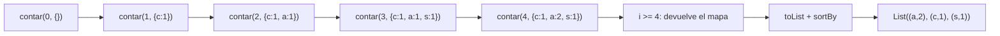

# Informe de corrección — Taller 1: cifrados clásicos con recursión

Este informe argumenta que cada función implementada (puntos 1 a 5) hace lo que pide el enunciado. Para las funciones con recursión lineal se usa **inducción estructural** sobre el mensaje; para las de cola se usa **estado, invariante y transformación**, y se demuestra que el invariante se conserva en cada llamado y que al terminar implica el resultado esperado.

## 0. Notación y lema base

Sea $\Sigma=\{a,\dots,z\}$ el alfabeto de 26 letras minúsculas. Para un carácter $c$ escribimos $L(c)$ si $c\in\Sigma$ (las mayúsculas, tildes, dígitos, espacios y signos **no** son letras), y $\operatorname{pos}(c)=c-\texttt{'a'}\in\{0,\dots,25\}$ su posición. Un mensaje es una secuencia $m = c_1c_2\cdots c_n$; $\varepsilon$ es el mensaje vacío, $c\cdot r$ es el mensaje con cabeza $c$ y cola $r$, y $\cdot$ también denota concatenación. Además $\#_c(x)$ es el número de apariciones del carácter $c$ en $x$.

El operador $\bmod$ matemático siempre devuelve un valor en $\{0,\dots,25\}$. En Scala, `%` puede dar negativos; la expresión `((x % 26) + 26) % 26` sí equivale a $x \bmod 26$, porque `x % 26` está en $(-26,26)$, sumarle 26 lo vuelve no negativo sin cambiar la clase módulo 26, y el segundo `% 26` lo lleva a $\{0,\dots,25\}$. Se asume que $k$ no es tan grande como para desbordar `Int` al sumar $p+k$.

El desplazamiento de un carácter es:

$$
f_k(c)=
\begin{cases}
\operatorname{chr}\big(97+((\operatorname{pos}(c)+k)\bmod 26)\big) & \text{si } L(c)\\
c & \text{en otro caso}
\end{cases}
$$

**Lema 1 (propiedades de $f_k$).** Para todo $k\in\mathbb{Z}$ y todo carácter $c$:

1. $f_{k+26}(c)=f_k(c)$.
2. $f_{-k}(f_k(c))=c$.
3. Si $\lnot L(c)$ entonces $f_k(c)=c$.

*Demostración.* (3) es la segunda rama de la definición. Para una letra con $p=\operatorname{pos}(c)$:

(1) $(p+k+26)\bmod 26=(p+k)\bmod 26$ porque $26\equiv 0 \pmod{26}$.

(2) Como $x\bmod 26\equiv x \pmod{26}$,
$$\big(((p+k)\bmod 26)-k\big)\bmod 26=(p+k-k)\bmod 26=p\bmod 26=p,$$
la última igualdad porque $0\le p\le 25$. Además $f_k(c)$ sigue siendo una letra, así que $f_{-k}$ la trata como letra. $\blacksquare$

El punto 1 del lema es la razón por la que "el desplazamiento puede ser negativo o mayor que 26" no necesita casos especiales: $f_k=f_{k \bmod 26}$.

---

## 1. Punto 1 — `cesar` (recursión lineal)

### Implementación analizada

```scala
def cesar(m: Mensaje, k: Int): Mensaje = {
  if (m.isEmpty) ""
  else {
    val cifrado = m.head
    if (esMinuscula(cifrado))
      ((((cifrado - primera + k) % 26) + 26) % 26 + primera).toChar + cesar(m.tail, k)
    else cifrado + cesar(m.tail, k)
  }
}
```

La rama de letra calcula $\operatorname{chr}\big(97+((p+k)\bmod 26)\big)=f_k(c)$ y la otra rama deja el carácter igual, que es $f_k(c)$ para una no-letra. En ambas, el resultado es $f_k(c)$ concatenado con el cifrado del resto.

### Especificación

$$
\operatorname{cesar}(m,k)=f_k(c_1)\cdot f_k(c_2)\cdots f_k(c_n)\qquad\text{para } m=c_1\cdots c_n .
$$

### Teorema 1

Para todo $m\in\text{Mensaje}$ y todo $k\in\mathbb{Z}$, `cesar(m, k)` termina y devuelve $f_k(c_1)\cdots f_k(c_n)$.

*Demostración por inducción estructural sobre $m$* (con $k$ fijo).

- **Caso base** $m=\varepsilon$. La condición `m.isEmpty` es verdadera y se devuelve $\varepsilon$, que es el producto vacío de la especificación.
- **Paso inductivo** $m=c\cdot r$. **Hipótesis:** `cesar(r, k)` $=f_k(r_1)\cdots f_k(r_{n-1})$. Como $m$ no es vacío, el resultado es $f_k(c)\cdot\operatorname{cesar}(r,k)$, que por hipótesis es $f_k(c)\cdot f_k(r_1)\cdots f_k(r_{n-1})$, es decir, la especificación para $m$.
- **Terminación.** Cada llamado recursivo recibe `m.tail`, de longitud $|m|-1$; la longitud es un natural estrictamente decreciente y el caso base la detiene en $0$. $\blacksquare$

**Consecuencias** (se siguen del Teorema 1 y del Lema 1):

- *Caracteres que no son letras minúsculas pasan sin cambio:* por Lema 1.3.
- *Negativos y mayores que 26:* por Lema 1.1, `cesar(m, 29)` $=$ `cesar(m, 3)`.
- *Inversa:* `cesar(cesar(m, k), -k)` $= m$, por Lema 1.2 aplicado letra a letra.

### Cómo se encadenan los llamados

Para `cesar("casa", 3)`, cada llamado deja pendiente la concatenación con su cabeza; el resultado se arma al regresar:



Se llega a `"fdvd"`, como pide el enunciado.

---

## 2. Punto 2 — `cesarCola` (recursión de cola)

### Implementación analizada

```scala
@tailrec
final def cesarCola(m: Mensaje, k: Int, acc: Mensaje = ""): Mensaje = {
  if (m.isEmpty) acc
  else {
    val primero = m.head
    val caracterCesar = {
      if (esMinuscula(primero))
        ((primero.toInt - primera + k) % letras + letras) % letras + primera
      else
        primero.toInt
    }.toChar
    cesarCola(m.tail, k, acc + caracterCesar)
  }
}
```

El valor `caracterCesar` es $f_k(\text{primero})$, con el mismo argumento del punto 1.

### Estado, invariante y transformación

- **Estado:** la terna $(m,k,\text{acc})$. Sea $m_0$ el mensaje original.
- **Invariante** $I(m,\text{acc})$:
  $$
  \text{acc}\cdot\operatorname{cesar}(m,k)=\operatorname{cesar}(m_0,k).
  $$
- **Transformación:** $(c\cdot r,\ \text{acc})\ \longmapsto\ (r,\ \text{acc}\cdot f_k(c))$.

### Teorema 2

Para todo $m_0$ y $k$, `cesarCola(m0, k)` $=$ `cesar(m0, k)`.

*Demostración.*

1. **Inicialización.** El llamado inicial usa $\text{acc}=\varepsilon$, entonces $\varepsilon\cdot\operatorname{cesar}(m_0,k)=\operatorname{cesar}(m_0,k)$: $I$ vale.
2. **Conservación.** Supongamos $I(c\cdot r,\text{acc})$. Por el Teorema 1, $\operatorname{cesar}(c\cdot r,k)=f_k(c)\cdot\operatorname{cesar}(r,k)$. Entonces
   $$
   \operatorname{cesar}(m_0,k)=\text{acc}\cdot f_k(c)\cdot\operatorname{cesar}(r,k)=(\text{acc}\cdot f_k(c))\cdot\operatorname{cesar}(r,k),
   $$
   por asociatividad de la concatenación. Esto es exactamente $I(r,\text{acc}\cdot f_k(c))$: el invariante se conserva.
3. **Terminación.** $|m|$ decrece en 1 en cada llamado, igual que en el punto 1.
4. **Salida.** Cuando $m=\varepsilon$ la función devuelve acc. Por el invariante y $\operatorname{cesar}(\varepsilon,k)=\varepsilon$:
   $$
   \text{acc}=\text{acc}\cdot\varepsilon=\text{acc}\cdot\operatorname{cesar}(\varepsilon,k)=\operatorname{cesar}(m_0,k).\qquad\blacksquare
   $$

**Por qué es recursión de cola.** En la rama recursiva, la llamada a `cesarCola` es la *última* operación: no queda nada pendiente por hacer con su resultado (el trabajo de combinar, `acc + caracterCesar`, se hace *antes* de llamar, al construir el argumento). Por eso el compilador puede reutilizar el marco de pila y `@tailrec` compila. En `cesar`, en cambio, queda pendiente la concatenación después de cada llamado, y por eso no es de cola.

### Cómo se encadenan los llamados

Para `cesarCola("casa", 3)` el acumulador crece y no hay nada pendiente:



---

## 3. Punto 3 — `frecuencias` (conteo con recursión de cola)

### Implementación analizada

```scala
def frecuencias(m: Mensaje): Frecuencias = {

  @tailrec
  def contar(i: Int, acc: Map[Char, Int]): Map[Char, Int] =
    if (i >= m.length) acc
    else {
      val c = m(i)
      if (c >= 'a' && c <= 'z')
        contar(i + 1, acc + (c -> (acc.getOrElse(c, 0) + 1)))
      else
        contar(i + 1, acc)
    }

  contar(0, Map.empty[Char, Int]).toList
    .sortBy { case (letra, frecuencia) => (-frecuencia, letra) }
}
```

El `Map` es inmutable: `acc + (c -> n)` devuelve un mapa nuevo, no hay variables mutables ni ciclos. El recorrido avanza con un índice $i$ en lugar de recortar el mensaje.

### Estado, invariante y transformación

Sea $m[i..]$ el sufijo de $m$ que empieza en la posición $i$ (con $m[|m|..]=\varepsilon$).

- **Estado:** $(i,\text{acc})$, con $\text{acc}(c)=0$ si $c\notin\operatorname{dom}(\text{acc})$.
- **Invariante** $J$: $0\le i\le |m|$ y, para toda letra $c\in\Sigma$,
  $$
  \text{acc}(c)+\#_c(m[i..])=\#_c(m).
  $$
- **Transformación:** $i\mapsto i+1$; si $L(m(i))$, se suma 1 a $\text{acc}(m(i))$; si no, acc queda igual.

### Teorema 3

`frecuencias(m)` devuelve la lista de pares $(c,\#_c(m))$ con $\#_c(m)>0$, ordenada por frecuencia descendente y, a igual frecuencia, por letra ascendente; y el recorrido es de cola.

*Demostración.*

1. **Inicialización.** Con $i=0$ y $\text{acc}=\emptyset$: $0+\#_c(m[0..])=\#_c(m)$. $J$ vale.
2. **Conservación.** Sea $h=m(i)$; se tiene $\#_c(m[i..])=\#_c(m[i{+}1..])+[c=h]$.
  - Si $L(h)$: el nuevo acc cumple $\text{acc}'(h)=\text{acc}(h)+1$ y $\text{acc}'(c)=\text{acc}(c)$ para $c\ne h$. Para $c=h$: $\text{acc}(h)+1+\#_h(m[i{+}1..])=\text{acc}(h)+\#_h(m[i..])=\#_h(m)$; para $c\neq h$ nada cambia. $J$ se conserva.
  - Si $\lnot L(h)$: $\#_c(m[i..])=\#_c(m[i{+}1..])$ para toda letra $c$ y acc no cambia. $J$ se conserva.
3. **Terminación.** La medida $|m|-i$ es un natural que decrece en 1 por llamado y la recursión se detiene cuando $i\ge|m|$.
4. **Salida.** Con $i\ge|m|$ el sufijo es vacío, $\#_c(\varepsilon)=0$ y $J$ da $\text{acc}(c)=\#_c(m)$ para toda letra. Además, solo están en el mapa las letras que se incrementaron al menos una vez, o sea las que aparecen: *las letras ausentes no salen* y los dígitos, espacios y signos nunca entran.
5. **Orden.** `sortBy` con la llave $(-n,c)$ ordena por el orden lexicográfico de pares: primero por $-n$ ascendente (frecuencia descendente) y, ante empate, por $c$ ascendente (orden alfabético). Como las letras del mapa son distintas, dos elementos nunca tienen la misma llave, así que el orden es **total** y el resultado es único. $\blacksquare$

**Es de cola:** el llamado a `contar` es lo último que se ejecuta en sus dos ramas recursivas; la ordenación ocurre después, fuera de la recursión, y el enunciado permite usar la biblioteca para ella.

### Cómo se encadenan los llamados

Para `frecuencias("casa")`:



---

## 4. Punto 4 — `desplazamientoProbable` y `romperCesar`

### Implementación analizada

```scala
def desplazamientoProbable(m: Mensaje): Int = {
  val conteo: Map[Char, Int] =
    m.filter(c => c >= 'a' && c <= 'z')
      .groupBy(identity)
      .map { case (letra, ocurrencias) => letra -> ocurrencias.length }

  if (conteo.isEmpty) 0
  else {
    val maxFrecuencia = conteo.values.max
    val candidatas = conteo.collect { case (letra, f) if f == maxFrecuencia => letra }
    val letraMasFrecuente = candidatas.min

    (((letraMasFrecuente - 'e') % 26) + 26) % 26
  }
}

def romperCesar(m: Mensaje): Mensaje = {
  val k = desplazamientoProbable(m)
  cesar(m, -k)
}
```

### Corrección respecto de la especificación

**Lema 2.** `conteo(c)` $=\#_c(m)$ para toda letra que aparece, y `conteo` no contiene otras claves. *Prueba:* el `filter` conserva exactamente las letras minúsculas; `groupBy(identity)` agrupa las apariciones iguales, y la longitud de cada grupo es $\#_c(m)$.

**Lema 3.** `letraMasFrecuente` es la primera letra de `frecuencias(m)`. *Prueba:* `maxFrecuencia` es el mayor conteo, `candidatas` son las letras que lo alcanzan y `candidatas.min` es la menor alfabéticamente. Por el Teorema 3, la cabeza de `frecuencias(m)` es el elemento de menor llave $(-n,c)$, es decir, de mayor $n$ y, entre esas, de menor $c$. Es la misma letra.

Sea $\ell^*(m)$ esa letra. Entonces:

$$
d(m)=
\begin{cases}
0 & \text{si } m \text{ no tiene letras}\\
\big(\operatorname{pos}(\ell^*(m))-\operatorname{pos}(\texttt{e})\big)\bmod 26 & \text{en otro caso}
\end{cases}
$$

que es la distancia entre `e` y la letra más frecuente, normalizada a $\{0,\dots,25\}$ (Lema 2, Lema 3 y la nota del apartado 0 sobre `%`). Con los ejemplos del enunciado: para `"h"`, $(7-4)\bmod 26=3$; para `"hhhaaa"` gana `a` por empate y $(0-4)\bmod 26=22$; para `"123"` no hay letras y $d=0$. `romperCesar` es, por definición, descifrar con la estimación: $\operatorname{cesar}(m,-d(m))$.

### Teorema 4 (cuándo el método acierta)

Sea $t$ un texto claro y $m=\operatorname{cesar}(t,k)$. Si en $t$ la letra `e` es la **única** más frecuente (estrictamente más frecuente que cualquier otra letra), entonces $d(m)=k\bmod 26$ y $\operatorname{romperCesar}(m)=t$.

*Demostración.* Como $f_k$ es una biyección de $\Sigma$ en $\Sigma$ (Lema 1.2), $\#_{f_k(x)}(m)=\#_x(t)$ para toda letra $x$: cifrar solo renombra las letras. Por tanto la letra estrictamente más frecuente de $m$ es $f_k(\texttt{e})$, con posición $(4+k)\bmod 26$, y al ser única no interviene el desempate. Así
$$
d(m)=\big((4+k)\bmod 26-4\big)\bmod 26=k\bmod 26 .
$$
Por el Lema 1 (puntos 1 y 2), $\operatorname{cesar}(m,-d(m))=\operatorname{cesar}(\operatorname{cesar}(t,k),-k)=t$. $\blacksquare$

Ejemplo que sí acierta: `romperCesar(cesar("el mensaje secreto", 7))`. En `"el mensaje secreto"` la `e` aparece 5 veces y ninguna otra letra llega a eso; cifrada con $k=7$ la más frecuente es `l`, $d=(11-4)\bmod 26=7$ y se recupera el original.

### En qué condiciones falla

El Teorema 4 da la respuesta por contraposición: el método **falla** cuando la hipótesis no se cumple, es decir, cuando en el texto claro $t$:

1. **La `e` no es la letra más frecuente.** El método supone una propiedad estadística del español que solo es probable en textos largos; en textos cortos, sin `e`, o en otro idioma, otra letra puede ganar.
2. **Hay empate en el máximo.** El desempate es alfabético *sobre el texto cifrado*, y cifrar **no preserva el orden alfabético** (por el módulo 26). Puede ganar una letra que no corresponde a la `e`.

(Si el mensaje no tiene letras, $d=0$ y `romperCesar` lo devuelve igual, que es correcto; no es una falla.)

### Mensajes concretos donde falla

**(a) La `e` no es la más frecuente.** Sea $t=\texttt{"aaa"}$ y $k=3$, de modo que $m=\texttt{"ddd"}$.

- El conteo es `Map('d' -> 3)`, luego $d=(3-4)\bmod 26=25$.
- `romperCesar("ddd")` $=\operatorname{cesar}(\texttt{"ddd"},-25)=\texttt{"eee"}\neq\texttt{"aaa"}$.

El método supone que `d` es una `e` desplazada y "descifra" hacia un texto lleno de `e`.

**(b) Empate que cambia el ganador.** Sea $t=\texttt{"ea"}$ y $k=0$, de modo que $m=\texttt{"ea"}$.

- `a` y `e` empatan con 1 aparición; gana `a` por ser menor, luego $d=(0-4)\bmod 26=22$.
- `romperCesar("ea")` $=\operatorname{cesar}(\texttt{"ea"},-22)=\texttt{"ie"}\neq\texttt{"ea"}$.

Aquí el texto estaba sin cifrar ($k=0$) y la `e` empataba con la `a`: el desempate alfabético eligió la letra equivocada.

---

## 5. Resumen

| Función | Técnica de prueba | Resultado |
|---|---|---|
| `cesar` | Inducción estructural sobre $m$ | $f_k$ aplicado letra a letra |
| `cesarCola` | Invariante $\text{acc}\cdot\operatorname{cesar}(m,k)=\operatorname{cesar}(m_0,k)$ | Igual a `cesar` para toda entrada |
| `frecuencias` | Invariante $\text{acc}(c)+\#_c(m[i..])=\#_c(m)$ | Conteo exacto y orden total |
| `desplazamientoProbable` / `romperCesar` | Biyección de $f_k$ y unicidad del máximo | Correcto si `e` es el máximo único; falla con `"aaa"` ($k=3$) y `"ea"` ($k=0$) |

