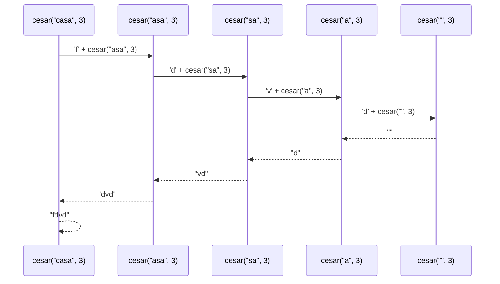
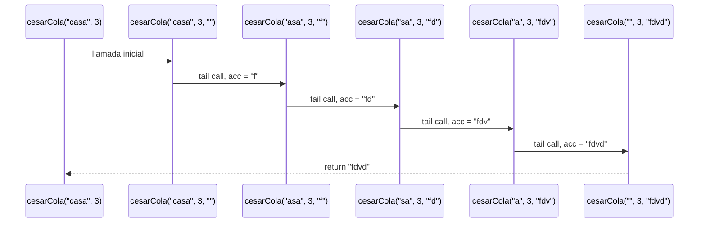
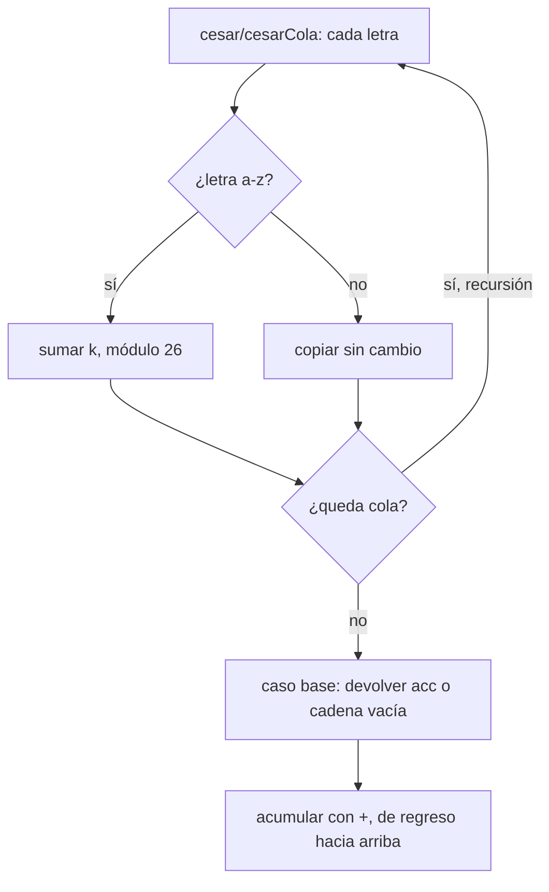
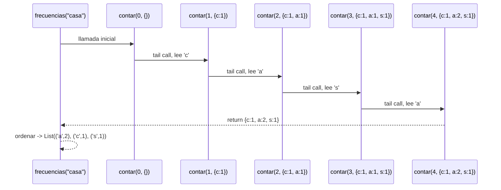
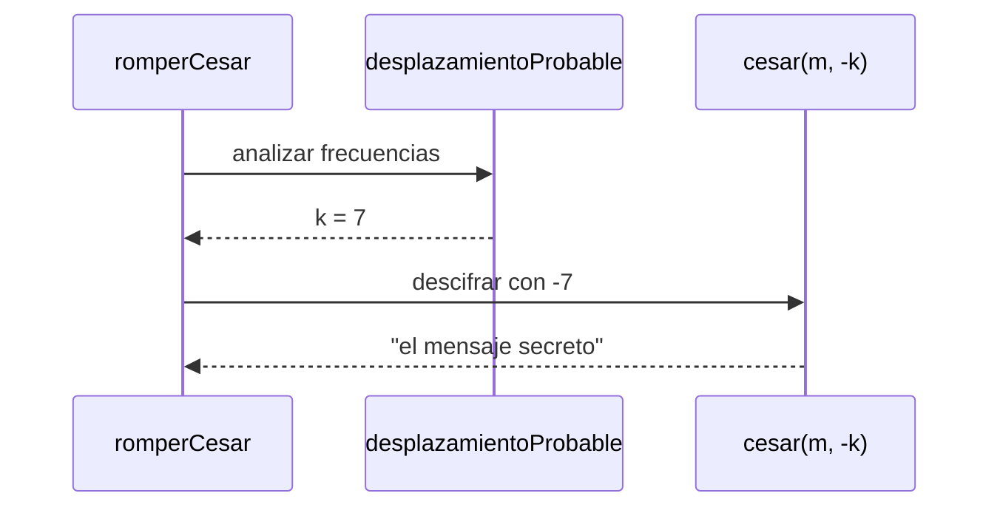
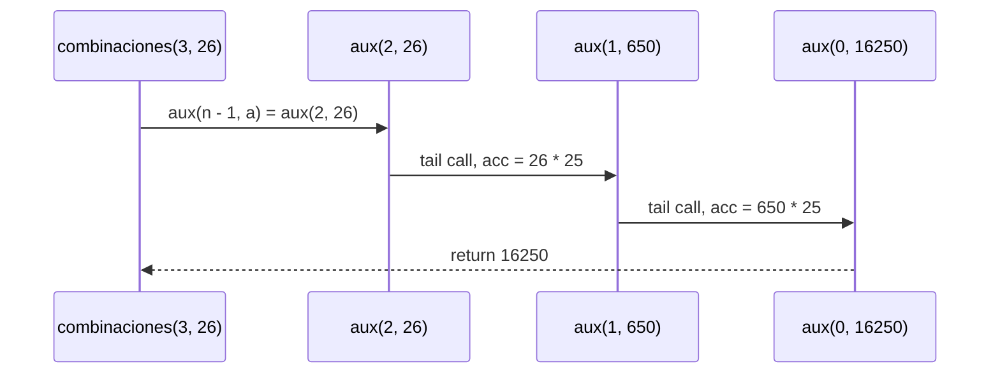
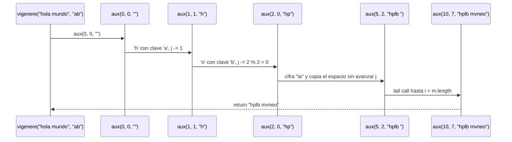

# Informe de proceso

Fundamentos de Programación Funcional y Concurrente — Taller 1: cifrados clásicos.
Este informe muestra cómo se ejecuta paso a paso cada función en
`app/src/main/scala/taller/CifradosClasicos.scala` y cuál es el estado de la pila
de llamados en cada punto. Se cubren los cinco puntos del taller.

El modelo de datos común es:

```scala
type Mensaje = String
type Clave = String
type Frecuencias = List[(Char, Int)]
val letras = 26
val primera = 'a'.toInt
def esMinuscula(c: Char): Boolean = c >= 'a' && c <= 'z'
```

Cifrar una letra de posición $p$ con desplazamiento $k$ es
$p' = (((p + k) \bmod 26) + 26) \bmod 26$, y toda letra que no esté entre `a` y `z`
se copia sin cambio.

## 1. Punto 1: `cesar` con recursión lineal

```scala
def cesar(m: Mensaje, k: Int): Mensaje = {
  if (m.isEmpty) ""
  else {
    val cifrado = m.head
    if (esMinuscula(cifrado))
      ((((cifrado - primera + k) % 26) + 26) % 26 + primera).toChar + cesar(m.tail, k)
    else cifrado + cesar(m.tail, k)
  }
}
```

El caso base es el mensaje vacío. En el caso recursivo se cifra la cabeza y se
concatena con el resultado de cifrar la cola: la suma `+` queda pendiente hasta
que la llamada recursiva retorna. La recursión es lineal: se acumula una operación
pendiente por cada letra.

### Traza de `cesar("casa", 3)`

| Paso | Llamada | Cabeza | Operación pendiente |
| ---- | ------- | ------ | ------------------- |
| 1 | `cesar("casa", 3)` | `c` | `'f' + _` |
| 2 | `cesar("asa", 3)` | `a` | `'d' + _` |
| 3 | `cesar("sa", 3)` | `s` | `'v' + _` |
| 4 | `cesar("a", 3)` | `a` | `'d' + _` |
| 5 | `cesar("", 3)` | — | caso base: `""` |

La pila crece hasta 5 marcos (uno por llamada) y luego se desarma resolviendo las
concatenaciones de abajo hacia arriba:

$$\text{cesar}("a",3) \rightarrow \text{'d'} + "" \rightarrow \text{"d"}$$
$$\text{cesar}("sa",3) \rightarrow \text{'v'} + \text{"d"} \rightarrow \text{"vd"}$$
$$\text{cesar}("asa",3) \rightarrow \text{'d'} + \text{"vd"} \rightarrow \text{"dvd"}$$
$$\text{cesar}("casa",3) \rightarrow \text{'f'} + \text{"dvd"} \rightarrow \text{"fdvd"}$$



Con un mensaje de $n$ letras la pila alcanza $n$ marcos: para entradas muy largas el
proceso desborda la pila.

## 2. Punto 2: `cesarCola` con recursión de cola

```scala
@tailrec
final def cesarCola(m: Mensaje, k: Int, acc: Mensaje = ""): Mensaje = {
  if (m.isEmpty) acc
  else {
    val primero = m.head
    val caracterCesar = {
      if (esMinuscula(primero)) ((primero.toInt - primera + k) % letras + letras) % letras + primera
      else primero.toInt
    }.toChar
    cesarCola(m.tail, k, acc + caracterCesar)
  }
}
```

Aquí la letra ya cifrada se acumula en `acc` y la llamada recursiva es la última
instrucción, por lo que `@tailrec` la convierte en un ciclo.

### Traza de `cesarCola("casa", 3)`

| Paso | `m` | `k` | `acc` entrante | `acc` resultante |
| ---- | --- | --- | -------------- | ---------------- |
| 1 | `"casa"` | 3 | `""` | `"f"` |
| 2 | `"asa"` | 3 | `"f"` | `"fd"` |
| 3 | `"sa"` | 3 | `"fd"` | `"fdv"` |
| 4 | `"a"` | 3 | `"fdv"` | `"fdvd"` |
| 5 | `""` | 3 | `"fdvd"` | caso base: `"fdvd"` |



### Por qué una pila crece y la otra no

En `cesar`, cada marco espera el resultado de la llamada siguiente para poder
completar su `+`; el trabajo pendiente es proporcional a $n$. En `cesarCola` cada llamada entrega el mensaje más corto
y el acumulador más completo, y no queda ninguna operación por resolver. El compilador reutiliza el
mismo marco entonces el espacio es constante, $O(1)$ y el proceso equivale a un
ciclo. Ambas versiones devuelven lo mismo para toda entrada.



## 3. Punto 3: `frecuencias` con recursión de cola

```scala
def frecuencias(m: Mensaje): Frecuencias = {
  @tailrec
  def contar(i: Int, acc: Map[Char, Int]): Map[Char, Int] =
    if (i >= m.length) acc
    else {
      val c = m(i)
      if (c >= 'a' && c <= 'z') contar(i + 1, acc + (c -> (acc.getOrElse(c, 0) + 1)))
      else contar(i + 1, acc)
    }
  contar(0, Map.empty[Char, Int]).toList
    .sortBy { case (letra, frecuencia) => (-frecuencia, letra) }
}
```

`contar` recorre el mensaje con un índice y acumula un mapa de conteos; es de cola
porque la llamada recursiva es lo último. Cuando termina el mapa se vuelve lista y se
ordena por frecuencia descendente y, en empate, por letra ascendente.

### Traza de `frecuencias("casa")`

| Paso | `i` | `m(i)` | ¿Letra? | `acc` resultante |
| ---- | --- | ------ | ------- | ---------------- |
| 1 | 0 | `c` | sí | `Map('c' -> 1)` |
| 2 | 1 | `a` | sí | `Map('c' -> 1, 'a' -> 1)` |
| 3 | 2 | `s` | sí | `Map('c' -> 1, 'a' -> 1, 's' -> 1)` |
| 4 | 3 | `a` | sí | `Map('c' -> 1, 'a' -> 2, 's' -> 1)` |
| 5 | 4 | — | — | final: `Map('c' -> 1, 'a' -> 2, 's' -> 1)` |

El ordenamiento produce `List(('a', 2), ('c', 1), ('s', 1))`: la `a` va primero por
tener mayor frecuencia y, entre `c` y `s` empatan y gana la menor alfabéticamente.
Los caracteres que no son letras (como el espacio de `"hola mundo"`) se saltan sin
tocar el acumulador, y por eso `frecuencias("123 !?")` es `List()`.



## 4. Punto 4: `desplazamientoProbable` y `romperCesar`

```scala
def desplazamientoProbable(m: Mensaje): Int = {
  val conteo: Map[Char, Int] = m.toLowerCase
    .filter(c => c >= 'a' && c <= 'z')
    .groupBy(identity)
    .map { case (letra, ocurrencias) => letra -> ocurrencias.length }

  if (conteo.isEmpty) 0
  else {
    val maxFrecuencia = conteo.values.max
    val candidatas = conteo.collect { case (letra, f) if f == maxFrecuencia => letra }
    (((candidatas.min - 'e') % 26) + 26) % 26
  }
}

def romperCesar(m: Mensaje): Mensaje = {
  val k = desplazamientoProbable(m)
  cesar(m, -k)
}
```

Se normaliza el mensaje, se agrupan las letras y, si hay conteos, se toma la de
mayor frecuencia y, en empate, la menor alfabéticamente (`candidatas.min`). El
desplazamiento es la distancia entre esa letra y la `e`, y `romperCesar` vuelve a
cifrar con el desplazamiento negado.

### Traza de `desplazamientoProbable("hhhaaa")`

| Paso | Operación | Resultado |
| ---- | --------- | --------- |
| 1 | filtrar minúsculas | `"hhhaaa"` |
| 2 | agrupar y contar | `Map('h' -> 3, 'a' -> 3)` |
| 3 | `maxFrecuencia` | `3` |
| 4 | candidatas (empate) | `['h', 'a']` → `min` = `'a'` |
| 5 | `(('a' - 'e') % 26 + 26) % 26` | `(((0 - 4) % 26) + 26) % 26 = 22` |

Sin letras, como en `"123"`, el mapa queda vacío y el resultado es `0`. Con `"h"`,
la única candidata es `'h'` y el desplazamiento es `3`.

### Traza de `romperCesar(cesar("el mensaje secreto", 7))`

| Paso | Expresión | Valor |
| ---- | --------- | ----- |
| 1 | `cesar("el mensaje secreto", 7)` | `"ls tlyzwhz zljylavy"` |
| 2 | `desplazamientoProbable(...)` | `7` (la letra más frecuente es la `l`) |
| 3 | `cesar("ls tlyzwhz zljylavy", -7)` | `"el mensaje secreto"` |

La estimación acierta porque la letra dominante del cifrado corresponde a la `e`
del original. Cuando el mensaje es muy corto o su letra más frecuente no es la `e`,
el desplazamiento estimado es otro y `romperCesar` no recupera el mensaje.



## 5. Punto 5: `combinaciones` y `vigenere`

### 5.1 `combinaciones(n, a)`

```scala
def combinaciones(n: Int, a: Int): BigInt = {
  @tailrec
  def aux(restantes: Int, acc: BigInt): BigInt =
    if (restantes == 0) acc
    else aux(restantes - 1, acc * (a - 1))
  if (n <= 0) BigInt(1)
  else if (a <= 0) BigInt(0)
  else aux(n - 1, BigInt(a))
}
```

El número de mensajes de longitud $n$ sin dos letras iguales seguidas cumple
$C(0,a) = 1$, $C(1,a) = a$ y $C(n,a) = (a-1) \cdot C(n-1,a)$ para $n > 1$. El código
evita repetir el caso $n = 1$: arranca el acumulador en $a$ y multiplica por $a-1$
exactamente $n-1$ veces, es decir, $\text{aux}(n-1, a) = a \cdot (a-1)^{n-1}$. La
llamada recursiva es lo último que hace, por eso `aux` lleva `@tailrec`. Los casos
límite se resuelven antes de entrar al ciclo: `n <= 0` devuelve $1$ (el mensaje
vacío) y `a <= 0` devuelve $0$.

#### Traza de `combinaciones(3, 26)`

Con $n = 3$ y $a = 26$, se llama `aux(2, 26)` y cada paso multiplica por $25$:

| Paso | `restantes` | `acc` entrante | `acc` resultante |
| ---- | ----------- | -------------- | ---------------- |
| 1 | 2 | 26 | 650 |
| 2 | 1 | 650 | 16250 |
| 3 | 0 | 16250 | caso base: 16250 |

Produce $26 \cdot 25 \cdot 25 = 16250$, que coincide con el valor del enunciado.
Los demás ejemplos se obtienen igual: `combinaciones(0, 26)` cae en `n <= 0` y da $1$;
`combinaciones(1, 26)` llama `aux(0, 26)` y da $26$; `combinaciones(2, 2)` da
$2 \cdot 1 = 2$.



### 5.2 `vigenere(m, clave)`

```scala
def vigenere(m: Mensaje, clave: Clave): Mensaje = {
  @tailrec
  def aux(i: Int, j: Int, acc: Mensaje): Mensaje =
    if (i >= m.length) acc
    else {
      val c = m(i)
      if (esMinuscula(c)) {
        val k = (((clave(j) - 'a') % letras) + letras) % letras
        val cifrada = ((c - 'a' + k) % letras + 'a').toChar
        aux(i + 1, (j + 1) % clave.length, acc + cifrada)
      } else
        aux(i + 1, j, acc + c)
    }
  if (clave.isEmpty) m else aux(0, 0, "")
}
```

`aux` recorre el mensaje con `i` y la clave con `j`, que avanza en forma circular
(`(j + 1) % clave.length`). La letra de la clave se convierte en un desplazamiento
entre $0$ y $25$, se suma a la posición de `c` módulo $26$ y el resultado se acumula.
Si `c` no es una letra minúscula, se copia tal cual **sin** avanzar `j`; así el
espacio de `"hola mundo"` no consume clave. El caso base del ciclo es `i >= m.length`
y, si la clave está vacía, se devuelve el mensaje sin tocar.

#### Traza de `vigenere("ataque", "sol")`

Clave `"sol"` → desplazamientos `s = 18`, `o = 14`, `l = 11`, que se repiten.

| Paso | `i` | `j` | `m(i)` | Letra clave | `k` | `acc` resultante |
| ---- | --- | --- | ------ | ----------- | --- | ---------------- |
| 1 | 0 | 0 | `a` | `s` | 18 | `"s"` |
| 2 | 1 | 1 | `t` | `o` | 14 | `"sh"` |
| 3 | 2 | 2 | `a` | `l` | 11 | `"shl"` |
| 4 | 3 | 0 | `q` | `s` | 18 | `"shli"` |
| 5 | 4 | 1 | `u` | `o` | 14 | `"shlii"` |
| 6 | 5 | 2 | `e` | `l` | 11 | `"shliip"` |
| 7 | 6 | 0 | — | — | — | final: `"shliip"` |

#### Traza de `vigenere("hola mundo", "ab")`

Clave `"ab"` → `a = 0`, `b = 1`. El espacio entre las dos palabras no avanza `j`.

| Paso | `i` | `j` | `m(i)` | Letra clave | `k` | `acc` resultante |
| ---- | --- | --- | ------ | ----------- | --- | ---------------- |
| 1 | 0 | 0 | `h` | `a` | 0 | `"h"` |
| 2 | 1 | 1 | `o` | `b` | 1 | `"hp"` |
| 3 | 2 | 0 | `l` | `a` | 0 | `"hpl"` |
| 4 | 3 | 1 | `a` | `b` | 1 | `"hplb"` |
| 5 | 4 | 2 | ` ` | — | — | `"hplb "` (copia, `j` sigue en 2) |
| 6 | 5 | 2 | `m` | `a` | 0 | `"hplb m"` |
| 7 | 6 | 3 | `u` | `b` | 1 | `"hplb mv"` |
| 8 | 7 | 4 | `n` | `a` | 0 | `"hplb mvn"` |
| 9 | 8 | 5 | `d` | `b` | 1 | `"hplb mvne"` |
| 10 | 9 | 6 | `o` | `a` | 0 | `"hplb mvneo"` |
| 11 | 10 | 7 | — | — | — | final: `"hplb mvneo"` |

La `m` de `mundo` se cifra con la letra `a` de la clave, que es la que sigue a la
`b` usada en la `a` de `hola`: el espacio se copió sin consumir clave.



Además, `vigenere("casa", "")` toma la rama `clave.isEmpty` y devuelve `"casa"` sin
entrar al ciclo.
